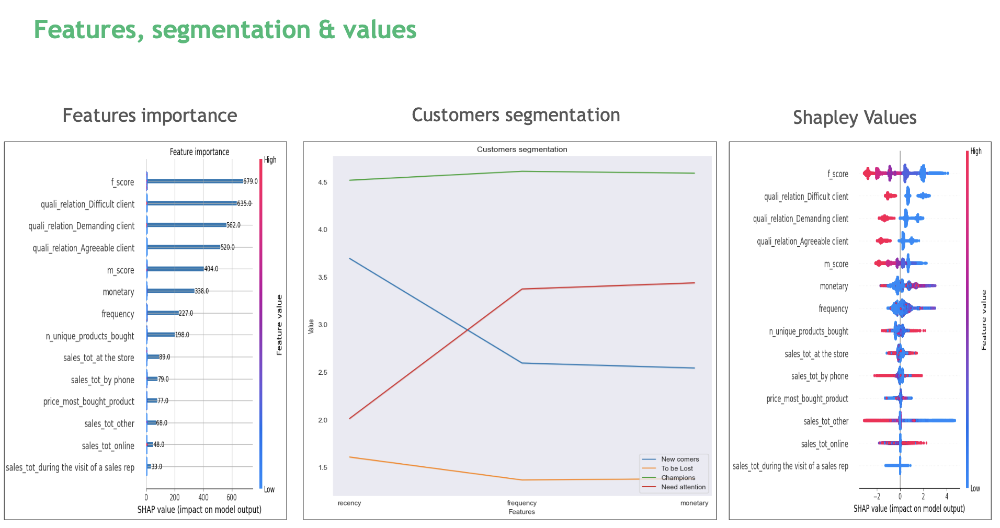

# Customer Churn Prediction (BCG Gamma)


This project's aim is to predict customer churn using transactional data, during a hackathon with BCG Gamma(2023). It uses XGBoost classifier and  Synthetic Minority Oversampling Technique (SMOTE) technique to predict whether a customer is likely to churn or not.

## Results

- 76% of churning customers identified (Recall)
- 55% of predicted churning found to have churned (Precision)
- 88% of non-churning customers identified


## Screenshots / Demo




## Run Locally

To use this project, you will need Docker installed on your machine. You can download Docker from the official website.

Once you have Docker installed, clone this repository and navigate to the project directory.


Build the Docker image using the following command:

```bash
docker build -t customer-churn .
```
This command will build a Docker image with the name customer-churn.

To run the Docker container and generate predictions, use the following command:

```
docker run customer-churn
```


## Authors
- Arsène  Tripard
- Youssef Jouini

## License

[MIT](https://choosealicense.com/licenses/mit/)
